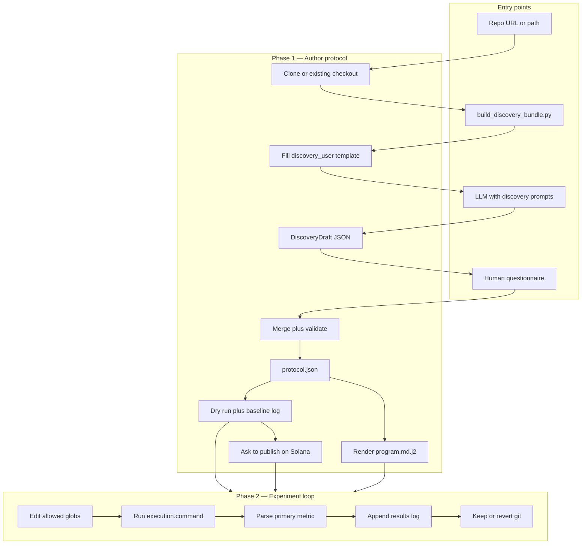
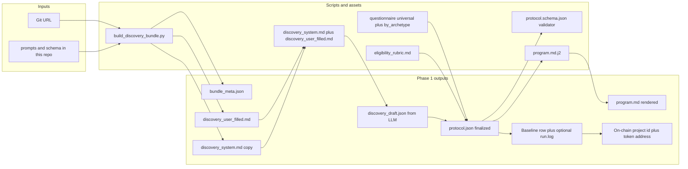
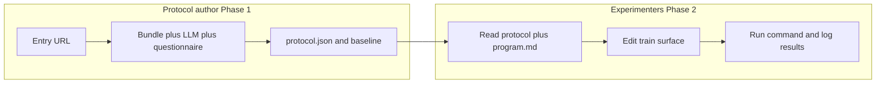

# Experiment protocol: practical flow

This document describes how Phase 1 (authoring a protocol from a repo) and Phase 2 (running experiments under that protocol) connect in practice: **entry points**, **touch points** (artifacts and tools), and **final outputs**.

---

## High-level picture

---

## Phase 1 — detailed touch points

**Reading left to right:** the human or automation starts from a **repo URL** (or `--existing-repo`). **`build_discovery_bundle`** is the main **entry point** that produces the **prompt bundle** (`discovery_user_filled.md`, `discovery_system.md`, `bundle_meta.json`). The **LLM** consumes those files and emits **`DiscoveryDraft` JSON**. The **questionnaire** plus merge step produces **`protocol.json`**, optional **`program.md`** via **Jinja**, and a **baseline** artifact after a **dry run**. If the project is eligible, the agent asks the user whether to publish to the Solana OpenResearch registry as the next step (0G Galileo remains an alternate path).

---

## Entry points (what you actually invoke)

| Step | Entry point | Purpose |
|------|-------------|---------|
| Bundle prompts | From this repo root: `python scripts/build_discovery_bundle.py <URL> --output-dir DIR` | Clone (optional), scan repo, fill template |
| Same repo, no clone | `... --existing-repo /path/to/repo --output-dir DIR` | Faster iteration on local checkout |
| Discovery LLM | Any agent/API: system = `prompts/discovery_system.md`, user = `discovery_user_filled.md` | Emit strict JSON matching **DiscoveryDraft** |
| Validate draft | JSON Schema: `protocol.schema.json` (this repo) | Reject malformed LLM output |
| Human gate | `questionnaire/universal.md` + `questionnaire/by_archetype/*.md` | Resolve blockers, globs, metric, eligibility |
| Final protocol | Merge DiscoveryDraft + answers → **`protocol.json`** (`schemaKind: "protocol"`) | Single source of truth for Phase 2 |
| Render narrative | `python scripts/render_program_md.py path/to/protocol.json` (requires `pip install jinja2`) | Human-readable **`program.md`** (not automatic when JSON changes) |
| Eligibility | `eligibility_rubric.md` | Decide `eligible` / `needs_harness` / `ineligible` |
| Baseline | Run `execution.command` from protocol on pinned setup | Prove runnable; record first metric row |
| Publish prompt (default) | `scripts/publish_project_solana.mjs` + `contracts/solana-open-research/deployment.json` + `references/onchain-solana.md` | Upload artifacts to Irys with the Solana browser wallet, then call Solana `createProject` via the localhost bridge after a successful measured baseline |
| Publish prompt (alternate) | `scripts/publish_project_0g.mjs` + `contracts/0g-galileo-testnet/deployment.json` + `references/onchain-0g-galileo.md` | 0G Galileo EVM `ProjectRegistry.createProject(...)` path; use only when the user explicitly opts in |

---

## Touch points (files you always touch)

| Artifact | Role |
|----------|------|
| [`prompts/discovery_system.md`](prompts/discovery_system.md) | Fixed system instructions for the discovery model |
| [`prompts/discovery_user.md`](prompts/discovery_user.md) | Template; filled copy is **`discovery_user_filled.md`** |
| [`protocol.schema.json`](protocol.schema.json) | Validates **DiscoveryDraft** and full **protocol** |
| [`questionnaire/universal.md`](questionnaire/universal.md) | Required human answers |
| [`questionnaire/by_archetype/*.md`](questionnaire/by_archetype/ml_train.md) | Branch-specific addenda |
| [`eligibility_rubric.md`](eligibility_rubric.md) | When Phase 1 can stop vs needs harness |
| [`templates/program.md.j2`](templates/program.md.j2) | Renders agent-facing **`program.md`** |
| [`archetypes.yaml`](archetypes.yaml) | Defaults and taxonomy reference |
| [`contracts/solana-open-research/deployment.json`](contracts/solana-open-research/deployment.json) | Solana OpenResearch program id, RPC defaults, and bundled IDL path |
| [`contracts/solana-open-research/open_research.json`](contracts/solana-open-research/open_research.json) | Bundled full Anchor IDL for Solana publish, mining, and verifier paths |
| [`references/onchain-solana.md`](references/onchain-solana.md) | Default Solana publish flow (browser-wallet, PDA seeds) |
| [`contracts/0g-galileo-testnet/deployment.json`](contracts/0g-galileo-testnet/deployment.json) | Alternate path: 0G Galileo registry addresses and ABI artifact paths |
| [`references/onchain-0g-galileo.md`](references/onchain-0g-galileo.md) | Alternate path: ABI-derived 0G Galileo publish, miner, and verifier flow |

---

## Final outputs (what Phase 2 needs)

| Output | Description |
|--------|-------------|
| **`protocol.json`** | Canonical machine-readable contract (`schemaKind: "protocol"`), includes `meta.protocolBundleId`, metric extract, globs, commands |
| **`program.md`** (optional but recommended) | Render of the same contract for humans and coding agents |
| **`bundle_meta.json`** | From the bundle script only: clone path, SHA, paths to schema — audit trail |
| **`discovery_draft.json`** (retained) | Raw LLM output for debugging / reproducibility |
| **Baseline record** | Row in `provenance.resultsLog` (e.g. `results.tsv`) + stored log artifact path |
| **Storage publish record** | `storage_irys.json` (default Solana path) or `storage_0g_galileo.json` (alternate 0G path): artifact paths, SHA-256 digests, Irys ids/gateway URLs, and upload receipts |
| **On-chain publish record** | Default: `publish_solana.json` with cluster, program id, transaction signature, project id, creator pubkey, accounts, args, and `signedBy` (`browserWallet` or `keypair`). Alternate: `publish_0g_galileo.json` with project id, token address, tx hash, chain id, registry addresses |
| **`needs_harness` follow-ups** | If rubric says so: issues or scripts to add before **`eligible`** |

Phase 2 **only** needs the **protocol bundle** ( **`protocol.json`** + baseline policy + optional **`program.md`** ); it does **not** need to re-run discovery unless the repo or contract changes.

---

## Two-operator split (optional)

The **handoff artifact** is **`protocol.json`** (and rendered **`program.md`**) plus **baseline** metadata referenced in **`meta.protocolBundleId`** / **`provenance`**.
