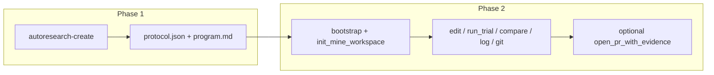

# autoresearch-mine workflow

Phase 1 (authoring), typically with **`autoresearch-create`**, produces `protocol.json` and optional `program.md`. Phase 2 (mining) consumes those artifacts in a target repo. **Miners only need `autoresearch-mine`:** the trial harness is bundled under [`vendor/harness/`](vendor/harness/) (vendored from the same scripts `autoresearch-create` uses in this monorepo).

- **Per-trial** time limits: `execution` in `protocol.json` (see `run_baseline.sh`).
- **Outer session** limits: optional `miningLoop` in `protocol.json`, merged by `read_mining_limits.py` with env fallbacks.
- **Frontier** for PRs: `.autoresearch/mine/network_state.json` — **manual** (`source: manual`) or synced from **`ProjectRegistry`** on 0G Galileo (`source: registry`; see **`scripts/sync_registry_frontier.py`**).

See [autoresearch-create/workflow.md](../autoresearch-create/workflow.md) for Phase 1 touch points.
