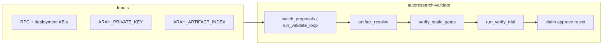

# autoresearch-validate workflow

Phase 2 miners submit `ProposalLedger.submit`; validators rerun benchmarks off-chain and settle with **`approve` / `reject` / `releaseReview`**.

See [`SKILL.md`](SKILL.md) for ordering and failure semantics.
